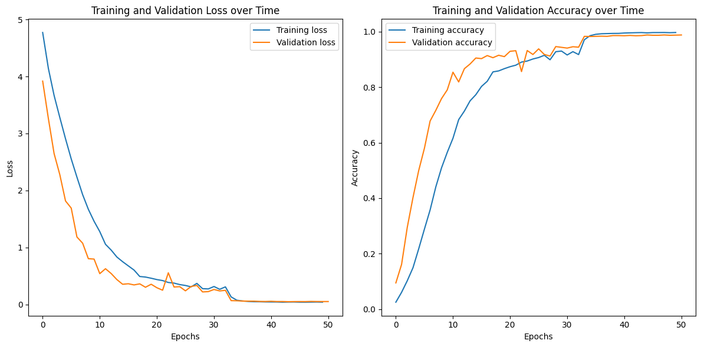
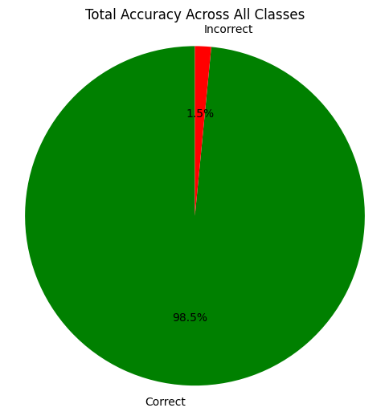
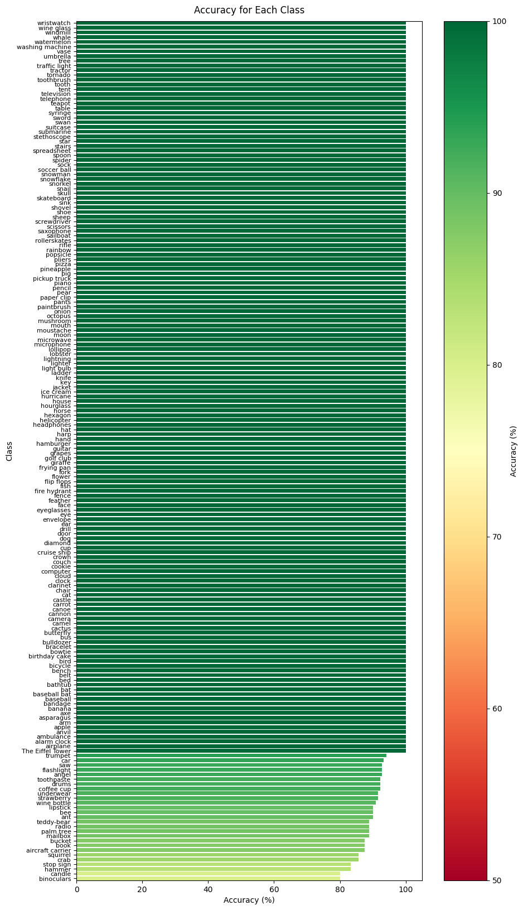
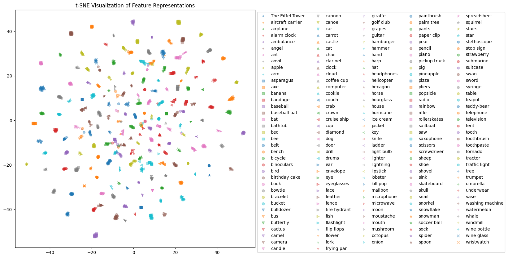

# The Doodle Zoo Application User Guide

## Introduction

This repository contains the code for the Doodle Zoo application as well as a python notebook for training the predictive model used for automatic doodle classification. A link to a pre-trained model is provided in this guide.

The Doodle Zoo application provides an interface that allows the user to:

-   View all doodles by category
-   Draw and submit new doodles which are automatically sorted by a classification model

The training notebook provides a step-by-step process for training a model on [this subset](https://www.kaggle.com/datasets/emiliuz/quick-draw-subset) of the [Quick! Draw!](https://quickdraw.withgoogle.com/) dataset. The model is a convolutional neural network based on the [ResNet](https://arxiv.org/pdf/1512.03385.pdf) architecture. The model is trained using [PyTorch](https://pytorch.org/). The notebook also tests the model and provides visualizations of the model's performance.

## Installation

### 1. Clone the repository

Clone this repository using the following command:

```bash
git clone https://github.com/Munkyfoot/doodle-zoo.git
```

### 2. Install the dependencies

Using the Anaconda package manager is recommended for this project. You can find instructions for installing Anaconda [here](https://docs.anaconda.com/anaconda/install/). This guide assumes you are using Anaconda.

Once Anaconda is installed, create a new environment for this project with Python installed. PyTorch2 currently supports Python 3.8 - 3.11. This project uses Python 3.10.

```bash
conda create -n doodle-zoo python=3.10
```

Activate the environment.

```bash
conda activate doodle-zoo
```

Install PyTorch2. It is recommended to use the instructions provided [here](https://pytorch.org/get-started/locally/) to ensure the best compatibility with your system.

Example installation command for a Windows machine with a GPU using CUDA 11.8:

```bash
pip install torch torchvision --index-url https://download.pytorch.org/whl/cu118
```

Install the remaining dependencies.

```bash
pip install -r requirements.txt
```

### 3. Download the dataset

Download the [Quick Draw Subset](https://www.kaggle.com/datasets/emiliuz/quick-draw-subset) from Kaggle.

Move the contents into the `data/base` directory. The directory structure should look like this:

```bash
data/
    base/
        aircraft carrier/
            aircraft carrier_4526723586588672.png
            ...
        ...
```

### 4. Download the pre-trained model (optional)

If you do not wish to train the model yourself, you can download a pre-trained model from Hugging Face [here](https://huggingface.co/mlenno1/doodle_prediction/tree/main).

Download doodle_prediction.pth.

Move the model into the `models` directory. The directory structure should look like this:

```bash
models/
    doodle_prediction.pth
```

## Usage

### 1. Train the model (optional)

If you wish to train the model yourself, you can use the `train.ipynb` notebook. The notebook provides a step-by-step process for training the model. The notebook also tests the model and provides visualizations of the model's performance.

You can also analyze the performance of a pre-trained model without training by setting the `train` flag in Step 4 to `False` before running the notebook. The flag is set to `False` by default to avoid overwriting the pre-trained model.

### 2. Run the application

Ensure you are using the proper environment. If you followed the steps outlined in the Installation instructions, you can do this by opening Anaconda Prompt and using the following command:

```bash
conda activate doodle-zoo
```

Run the application using the following command:

```bash
python main.py
```

The application will be available at `http://localhost:7860/`.

## About the Application

The application is built using [Gradio](https://www.gradio.app/). It features a simple interface that allows the user to:

-   View all doodles by category
-   Draw and submit new doodles which are automatically sorted by a classification model

Submitted doodles images are saved into the `data/user/<class>` directory, where `class` is the predicted class. The doodle's path is then stored in the database. If the prediction confidence is below a certain threshold (0.8 by default), the image is saved into the `data/user/undetermined` directory instead.

## About the Model

### Dataset

The dataset used for training the model is a processed subset of the [Quick! Draw!](https://quickdraw.withgoogle.com/) dataset. More information about the subset can be found [here](https://github.com/emizzz/Quick-Draw-Subset).

### Architecture

The model is a convolutional neural network based on the [ResNet](https://arxiv.org/pdf/1512.03385.pdf) architecture. The architecture includes modifications to the standard ResNet architecture, including dropout to reduce overfitting given the small size of the dataset used.

### Training

The training method implements several techniques for improving accuracy while reducing overfitting:

-   Data augmentation: The training data is augmented by randomly applying transformations to the images. This helps the model generalize better to new data. The transformations include:
    -   Random horizontal flip
    -   Random rotation (with expansion to avoid cropping)
-   Early stopping: The model is trained for a maximum number of epochs, but allows for early stopping if the validation accuracy does not improve for a set number of epochs.
-   Learning rate scheduling: Using the ReduceLROnPlateau scheduler, the learning rate is reduced when the validation accuracy plateaus.
-   Shared patience: The patience for early stopping and learning rate scheduling is shared. This means that if the validation accuracy does not improve for a certain number of epochs, the learning rate is reduced and the model is trained for a certain number of epochs. If the validation accuracy still does not improve, the model is stopped early. The scheduler's patience is set to 1/2 (rounded down) of the early stopping patience.

The loss function used is [Cross Entropy Loss](https://pytorch.org/docs/stable/generated/torch.nn.CrossEntropyLoss.html).

The optimizer used is [Stochastic Gradient Descent](https://pytorch.org/docs/stable/generated/torch.optim.SGD.html).

### Analysis

Here are some visualizations of the model's training and performance for the pre-trained model.

#### Training and Validation Loss / Accuracy



#### Total Accuracy on Test Set



#### Accuracy by Class on Test Set



#### t-SNE Feature Visualization on Test Set



## Resources

Several resources helped inform the development of this project. A list of these resources can be found [here](resources.md).
